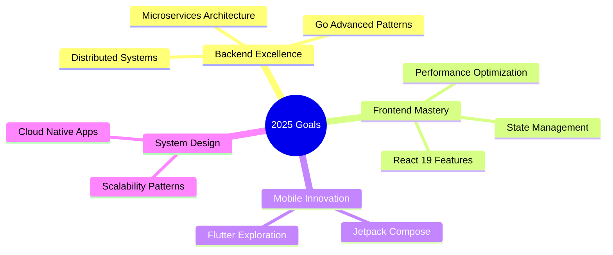

 

 

---

## 👨‍💻 About Me

Xin chào! Tôi là **MOD2090** - một software engineer đam mê xây dựng các giải pháp công nghệ có tác động thực tế. Với kinh nghiệm đa dạng từ mobile development đến system programming, tôi luôn tìm kiếm cách tối ưu và sáng tạo trong mỗi dự án.

---

## 🛠️ Tech Stack & Tools

### Languages

### Frontend Development

### Backend Development

### Databases & Cloud

### DevOps & Tools

### Game Development

---

## 🚀 Featured Projects

<table>
<tr>
<td width="50%">

### 🌐 [Modern Web Platform](https://github.com/Danchoimod/project-alpha)

Ứng dụng web full-stack với kiến trúc hiện đại

**Tech Stack:** React 18, Node.js, PostgreSQL

**Highlights:**
- ⚡ Server-side rendering cho hiệu năng tối ưu
- 🎨 UI/UX responsive với Tailwind CSS
- 🔐 JWT authentication & role-based access
- 📊 Real-time analytics dashboard

 

</td>
<td width="50%">

### ⚙️ [Go Microservices Suite](https://github.com/Danchoimod/go-microservices)

Hệ thống microservices hiệu năng cao

**Tech Stack:** Go, Docker, PostgreSQL, Redis

**Highlights:**
- 🚀 RESTful API với Gin framework
- 🔄 Message queue với RabbitMQ
- 📦 Containerized deployment
- 📈 Prometheus monitoring

 

</td>
</tr>
<tr>
<td width="50%">

### 🎮 [C++ Game Engine](https://github.com/Danchoimod/cpp-game-engine)

Game engine đa nền tảng với C++

**Tech Stack:** C++17, OpenGL, SDL2

**Highlights:**
- 🎯 2D/3D rendering pipeline
- 🔧 Physics engine integration
- 🎨 Cross-platform support
- 🛠️ Component-based architecture

 

</td>
<td width="50%">

### 📱 [Android Development Toolkit](https://github.com/Danchoimod/android-toolkit)

Bộ công cụ phát triển Android chuyên nghiệp

**Tech Stack:** Java, Kotlin, Android SDK

**Highlights:**
- 📦 Reusable UI components
- 🔐 Security best practices
- 🎨 Material Design 3
- ⚡ Performance optimization tools

 

</td>
</tr>
</table>

---

## 📊 GitHub Activity & Stats

### 🏆 GitHub Trophies

---

## 💼 Professional Contributions

### 🌟 Open Source Contributions

---

## 🎯 Current Learning & Focus

---

## 📚 Latest Blog Posts & Activities

<!-- BLOG-POST-LIST:START -->
- 🚀 Building Scalable Microservices with Go and Docker
- 💡 React Performance Optimization: Best Practices 2025
- 🔐 Implementing JWT Authentication in Spring Boot
- 🎮 Game Development with C++: From Basics to Advanced
- 📱 Modern Android Development with Kotlin & Jetpack
<!-- BLOG-POST-LIST:END -->

---

## 💬 Connect With Me

 

 

---

### 💡 "Code is like humor. When you have to explain it, it's bad." - Cory House

 

**Thank you for visiting! Let's build something amazing together** 🚀

 

---

  

